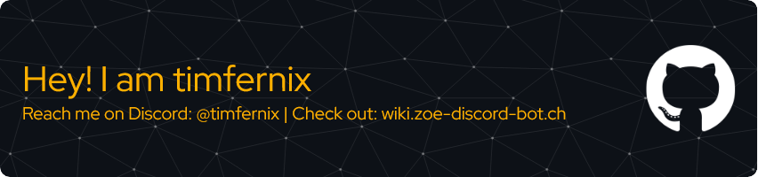

  

      

 

>✨ he/him  
>🌠German/English  
>🛠 Zoe Discord Bot - Staff Team  
> 💻 [Zoe Website](https://zoe-discord-bot.ch/), [Zoe Translations](https://translate.zoe-discord-bot.ch/) & [Zoe Wiki](https://wikizoe-discord-bot.ch/)  
>👼🏻 "Hey, Yuuto - wake up. It’s showtime. Let's protect the Galaxy!"

 

 

 

 

<!--
**timfernix/timfernix** is a ✨ _special_ ✨ repository because its `README.md` (this file) appears on your GitHub profile.

Here are some ideas to get you started:

- 🔭 I’m currently working on ...
- 🌱 I’m currently learning ...
- 👯 I’m looking to collaborate on ...
- 🤔 I’m looking for help with ...
- 💬 Ask me about ...
- 📫 How to reach me: ...
- 😄 Pronouns: ...
- ⚡ Fun fact: ...
-->
